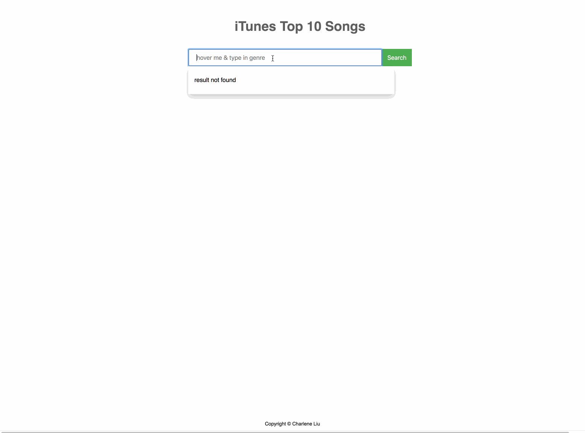

# ITunesSearchAnalyzer

> A web app for visualizing top 10 songs of searched genre. It was built for iTunes market research purpose. (it can be applied to any entity on Itunes. ex: podcast, books, movies, etc.)

Build with:
- [Angular CLI version 8](https://github.com/angular/angular-cli)
- Typescript
- ITunes search API
- Chart.js & ng2-charts
- RxJS
- python with selenium webdriver
  - scraped 250+ genre categories from iTunes website and converted them to json file automatically

## Demo



## Setup
1. Install all the dependencies

   ```npm install```

2. Builds and serves your app, rebuilding on file changes

   ```ng serve --open```


